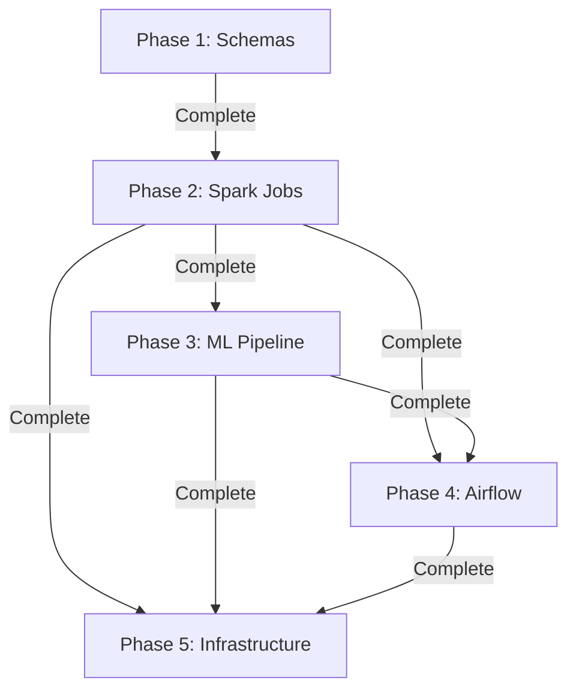

# 🗺️ CityFlow Data Processing - Implementation Roadmap

**Project:** CityFlow - Real-Time Transport & Traffic Monitoring System  
**Component:** Data Processing Layer  
**Last Updated:** January 9, 2026

---

## 📊 Overall Progress

```
┌─────────────────────────────────────────────────────────────┐
│  Phase 1: Schema Foundation           ████████████  100%  ✅ │
│  Phase 2: Spark Streaming Jobs        ████████████  100%  ✅ │
│  Phase 3: Machine Learning Pipeline   ░░░░░░░░░░░░   0%  ⏳ │
│  Phase 4: Airflow Orchestration       ░░░░░░░░░░░░   0%  ⏳ │
│  Phase 5: Infrastructure & Testing    ░░░░░░░░░░░░   0%  ⏳ │
└─────────────────────────────────────────────────────────────┘

Overall Completion: ████████░░░░░░░░░░ 40%
```

---

## ✅ Phase 1: Schema Foundation [COMPLETED]

**Duration:** ~2 hours  
**Status:** ✅ 100% Complete  
**Completion Date:** January 9, 2026

### Deliverables ✅
- [x] 5 Avro schema definitions
- [x] Schema Registry Docker setup
- [x] Registration scripts (Bash + PowerShell)
- [x] Validation tools
- [x] Comprehensive documentation
- [x] Java integration examples
- [x] Python integration examples

### Key Achievements
- 🎯 Schema-first design implemented
- 🎯 Backward compatibility ensured
- 🎯 Type safety with Avro
- 🎯 Production-ready infrastructure
- 🎯 Developer-friendly tooling

**📁 Location:** `data-processing/schemas/`

---

## ✅ Phase 2: Spark Streaming Jobs [COMPLETED]

**Estimated Duration:** 4-6 hours  
**Status:** ✅ 100% Complete  
**Completion Date:** January 9, 2026  
**Prerequisites:** ✅ Phase 1 Complete

### Components to Build

#### 2.1 Traffic Aggregation Job
**Purpose:** Real-time traffic metrics calculation

- [ ] **Kafka Source Configuration**
  - Consume from `traffic.reading.events`
  - Avro deserialization with Schema Registry
  - Watermark configuration for late data

- [ ] **Aggregation Logic**
  - 5-minute rolling window averages
  - 15-minute rolling window averages
  - 30-minute rolling window averages
  - Per road segment grouping

- [ ] **Output Sinks**
  - PostgreSQL: Historical aggregated data
  - Redis: Latest 30-min averages (TTL: 1 hour)
  - Delta Lake: Raw + aggregated data

- [ ] **Metrics to Calculate**
  - Average speed per segment
  - Vehicle count totals
  - Congestion level distribution
  - Incident frequency

**Files:**
- `spark-streaming/src/main/scala/jobs/TrafficAggregationJob.scala`
- `spark-streaming/src/main/scala/processors/TrafficAggregator.scala`
- `spark-streaming/src/main/scala/sinks/PostgresSink.scala`
- `spark-streaming/src/main/scala/sinks/RedisSink.scala`

#### 2.2 Bus ETL Job
**Purpose:** Process bus locations and calculate real-time metrics

- [ ] **Kafka Source Configuration**
  - Consume from `bus.location.events`
  - Avro deserialization

- [ ] **Processing Logic**
  - Calculate actual vs scheduled delays
  - Geospatial analysis (route matching)
  - Speed and heading smoothing
  - ETA calculations
  - Passenger occupancy trends

- [ ] **Output Sinks**
  - MongoDB: Current bus positions
  - Redis: Real-time positions (TTL: 5 min)
  - PostgreSQL: Historical trips
  - Delta Lake: All location history

**Files:**
- `spark-streaming/src/main/scala/jobs/BusETLJob.scala`
- `spark-streaming/src/main/scala/processors/BusProcessor.scala`
- `spark-streaming/src/main/scala/utils/GeospatialUtils.scala`

#### 2.3 Incident Enrichment Job
**Purpose:** Enrich incident events with contextual data

- [ ] **Kafka Source Configuration**
  - Consume from `incident.events`
  - Avro deserialization

- [ ] **Enrichment Logic**
  - Join with historical traffic data
  - Add weather information
  - Calculate affected routes
  - Estimate impact radius
  - Severity scoring

- [ ] **Output Sinks**
  - MongoDB: Active incidents
  - PostgreSQL: Incident history
  - Kafka: Enriched incident events (new topic)
  - Delta Lake: Incident analytics

**Files:**
- `spark-streaming/src/main/scala/jobs/IncidentEnrichmentJob.scala`
- `spark-streaming/src/main/scala/enrichers/IncidentEnricher.scala`

#### 2.4 Data Lake Ingestion Job
**Purpose:** Persist all events to Delta Lake for analytics

- [ ] **Multi-Topic Source**
  - Consume all 5 event topics
  - Unified processing pipeline

- [ ] **Delta Lake Writer**
  - Partitioning strategy (date + hour)
  - Schema evolution support
  - ACID transactions
  - Time travel capability

- [ ] **Data Quality Checks**
  - Null value validation
  - Schema conformance
  - Duplicate detection
  - Timestamp validation

**Files:**
- `spark-streaming/src/main/scala/jobs/DataLakeIngestionJob.scala`
- `spark-streaming/src/main/scala/writers/DeltaLakeWriter.scala`
- `spark-streaming/src/main/scala/quality/DataQualityValidator.scala`

#### 2.5 Real-time Analytics Job
**Purpose:** Generate live KPIs for dashboards

- [ ] **Multi-Topic Processing**
  - Traffic readings
  - Bus locations
  - Incidents

- [ ] **KPI Calculations**
  - Top 10 congested roads
  - Active incident count
  - Fleet status summary
  - Average city speed
  - On-time performance

- [ ] **Output**
  - Redis: Dashboard KPIs (update every 30s)
  - WebSocket: Real-time updates

**Files:**
- `spark-streaming/src/main/scala/jobs/RealTimeAnalyticsJob.scala`
- `spark-streaming/src/main/scala/analytics/KPICalculator.scala`

### Infrastructure Components

- [ ] **Build Configuration**
  - Maven/SBT setup
  - Dependencies management
  - Assembly JAR creation

- [ ] **Docker Images**
  - Spark master/worker images
  - Job submission scripts

- [ ] **Configuration Management**
  - Application.conf for each job
  - Environment-specific configs
  - Secrets management

- [ ] **Error Handling**
  - Dead Letter Queue implementation
  - Retry policies
  - Alert triggers

**Estimated Files:** 30-40 Scala/Java files  
**Estimated Lines of Code:** 3000-4000 lines

---

## ⏳ Phase 3: Machine Learning Pipeline [FUTURE]

**Estimated Duration:** 6-8 hours  
**Prerequisites:** Phase 2 Complete

### Components to Build

#### 3.1 Feature Engineering
- [ ] Extract temporal features (hour, day, month)
- [ ] Traffic pattern features (historical averages)
- [ ] Weather features
- [ ] Event features (holidays, special events)
- [ ] Geospatial features

#### 3.2 Model Training
- [ ] **Traffic Speed Prediction Model**
  - LSTM or XGBoost
  - 10-30 minute ahead prediction
  - Per road segment

- [ ] **Congestion Classification Model**
  - Multi-class classification
  - Real-time inference

- [ ] **Bus Delay Prediction Model**
  - Regression model
  - Per route predictions

#### 3.3 MLflow Integration
- [ ] Model versioning
- [ ] Experiment tracking
- [ ] Model registry
- [ ] Deployment automation

#### 3.4 Model Serving
- [ ] FastAPI serving endpoint
- [ ] Batch prediction jobs
- [ ] Real-time prediction stream

**Technologies:**
- Python 3.9+
- Scikit-learn / TensorFlow / PyTorch
- MLflow
- FastAPI

---

## ⏳ Phase 4: Airflow Orchestration [FUTURE]

**Estimated Duration:** 3-4 hours  
**Prerequisites:** Phase 2 & 3 Complete

### DAGs to Implement

#### 4.1 Daily Traffic Aggregation DAG
- [ ] Historical data rollup
- [ ] Partition management
- [ ] Data quality checks

#### 4.2 Weekly ML Retraining DAG
- [ ] Feature extraction
- [ ] Model training
- [ ] Model evaluation
- [ ] Model deployment

#### 4.3 Data Quality Monitoring DAG
- [ ] Schema validation
- [ ] Completeness checks
- [ ] Anomaly detection
- [ ] Alert generation

#### 4.4 Delta Lake Maintenance DAG
- [ ] Compaction (OPTIMIZE)
- [ ] Vacuum old files
- [ ] Statistics update
- [ ] Partition pruning

**Technologies:**
- Apache Airflow 2.7+
- Custom operators
- Sensors for data availability

---

## ⏳ Phase 5: Infrastructure & Testing [FUTURE]

**Estimated Duration:** 4-5 hours  
**Prerequisites:** All phases

### Components

#### 5.1 Kubernetes Deployment
- [ ] Helm charts for all components
- [ ] Auto-scaling policies
- [ ] Resource limits

#### 5.2 Monitoring & Observability
- [ ] Prometheus metrics
- [ ] Grafana dashboards
- [ ] Jaeger tracing
- [ ] Log aggregation

#### 5.3 Chaos Engineering
- [ ] Kafka failure scenarios
- [ ] Database latency injection
- [ ] Service crash tests

#### 5.4 Integration Tests
- [ ] End-to-end tests
- [ ] Performance tests
- [ ] Data quality tests

---

## 📅 Timeline

```
Week 1: ████████████████████████████████████  Phase 1 ✅
Week 2: ░░░░░░░░░░░░░░░░░░░░░░░░░░░░░░░░░░  Phase 2 ⏳
Week 3: ░░░░░░░░░░░░░░░░░░░░░░░░░░░░░░░░░░  Phase 3 ⏳
Week 4: ░░░░░░░░░░░░░░░░░░░░░░░░░░░░░░░░░░  Phase 4 ⏳
Week 5: ░░░░░░░░░░░░░░░░░░░░░░░░░░░░░░░░░░  Phase 5 ⏳
```

**Total Estimated Time:** 19-25 hours  
**Complexity Level:** Advanced

---

## 🎯 Success Criteria

### Phase 1 ✅
- [x] All schemas registered
- [x] Examples working
- [x] Documentation complete

### Phase 2 (Upcoming)
- [ ] All Spark jobs running
- [ ] Data flowing to all sinks
- [ ] Zero message loss
- [ ] < 5 second latency

### Phase 3 (Future)
- [ ] Models trained and deployed
- [ ] Prediction accuracy > 80%
- [ ] API response time < 100ms

### Phase 4 (Future)
- [ ] All DAGs scheduled
- [ ] No failed runs
- [ ] Data quality > 95%

### Phase 5 (Future)
- [ ] All services deployed to K8s
- [ ] Monitoring dashboards live
- [ ] Chaos tests passing

---

## 🔗 Dependencies



---

## 📚 References

- [Apache Spark Structured Streaming](https://spark.apache.org/docs/latest/structured-streaming-programming-guide.html)
- [Delta Lake Documentation](https://docs.delta.io/)
- [MLflow Documentation](https://mlflow.org/docs/latest/index.html)
- [Apache Airflow](https://airflow.apache.org/docs/)
- [Kafka Connect](https://docs.confluent.io/platform/current/connect/index.html)

---

**Status:** Phase 1 & 2 Complete ✅ | Ready for Testing & Phase 3 ⏳  
**Next Action:** Test complete pipeline (see TESTING_GUIDE.md)
